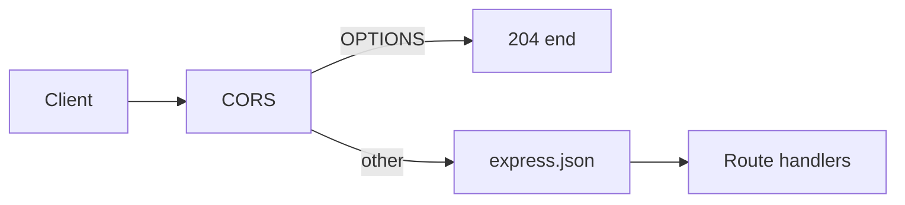
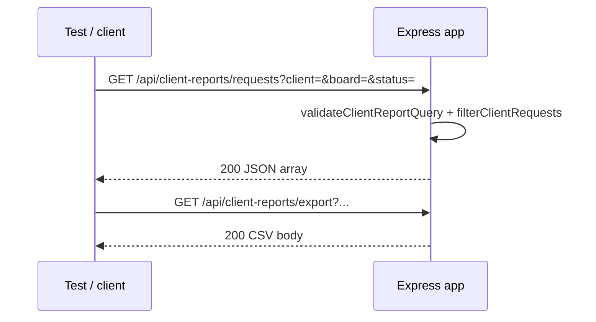

# Runtime and test flows

End-to-end documentation for the **testing-ai-agent** Express backend (`src/index.js`, `src/routes/auth.js`, `src/models/User.js`) and its integration tests. This file is read offline; nothing in the app serves it over HTTP.

## Bootstrap and export

- **Entry**: `src/index.js` builds a single Express `app`, wires middleware and routes, and exports it for tests.
- **Port**: `process.env.PORT` or default **3008**.
- **Version constant**: `APP_VERSION = process.env.npm_package_version || '1.0.0'` (npm sets `npm_package_version` when started via `npm start`; plain `node src/index.js` falls back to `1.0.0`).
- **Listen gate** (matches `src/index.js` export pattern):

```javascript
if (require.main === module) {
  app.listen(port, () => {
    console.log(`Server listening on port ${port}`);
  });
}

module.exports = app;
```

When the file is `require()`’d (e.g. from `test/*.test.js`), no listener starts. Tests mount `app` with `http.createServer(app)` and `listen(0)` on an ephemeral port.

**Scripts** (`package.json`):

- `npm start` → `npm run start:dev` → `node --watch src/index.js`
- `npm run start:prod` → `node src/index.js`
- `npm test` → chain of integration test files (see [Integration test execution path](#integration-test-execution-path))

## Global middleware (CORS + express.json)

Applied in order before any route handler (`src/index.js`):

1. **CORS** — Sets `Access-Control-Allow-Origin: http://localhost:5173` (local Vite dev client), allows methods `GET, POST, PUT, PATCH, DELETE, OPTIONS`, and headers `Content-Type, Authorization`. **OPTIONS** preflight requests respond with **204** and do not reach route handlers.
2. **`express.json()`** — Parses JSON bodies for `POST` routes; malformed JSON may yield **400**/**415** depending on Express behavior.

Responses are JSON, plain text, or CSV per handler (see route catalog).

**Peer Vite frontend** (separate repo): calculator and list pages call these flat paths via `VITE_API_BASE` and the dev-server proxy to this backend on port **3008**; UI hash routing is documented in the frontend repo, not here.



## Route catalog

Authoritative HTTP routes (method + path):

- `GET /hello`
- `POST /plus`
- `POST /count-characters`
- `POST /minus`
- `POST /multiply`
- `POST /power`
- `POST /divide`
- `POST /factorial`
- `GET /health-check`
- `GET /health`
- `GET /todaydatetime`
- `GET /version`
- `POST /api/auth/signup`
- `POST /api/auth/signin`
- `GET /api/users`
- `GET /api/client-reports/requests`
- `GET /api/client-reports/export`

All paths are on the root app unless noted. Unlisted methods/paths receive Express **404**.

| Method | Path | Auth | Response |
|--------|------|------|----------|
| GET | `/hello` | Public | **200** JSON `{ "message": "hello" }` |
| POST | `/plus` | Public | **200** `{ "result": a + b }` or **400** `{ "error": "a and b must be finite numbers" }` |
| POST | `/count-characters` | Public | **200** `{ "count": text.length }` or **400** `{ "error": "text must be a string" }`; unexpected errors **500** |
| POST | `/minus` | Public | Same operand validation as `/plus`; **200** `{ "result": a - b }` |
| POST | `/multiply` | Public | Same validation; **200** `{ "result": a * b }` (0 if either operand is 0) |
| POST | `/power` | Public | Same validation as `/multiply`; **200** `{ "result": Math.pow(a, b) }` or **400** `{ "error": "a and b must be finite numbers" }` |
| POST | `/divide` | Public | Same validation; **400** `{ "error": "b must not be zero" }` when `b === 0`; **200** `{ "result": a / b }` |
| POST | `/factorial` | Public | **200** `{ "result": n! }` for non-negative integer `n` (`0!`/`1!` → 1); **400** `{ "error": "n must be a non-negative integer" }` |
| GET | `/health-check` | Public | **200** plain text `Server is running` |
| GET | `/health` | Public | **200** JSON `{ "status": "ok" }` |
| GET | `/todaydatetime` | Public | **200** JSON `{ "datetime": "<ISO-8601>" }` |
| GET | `/version` | Public | **200** JSON `{ "version": "<APP_VERSION>" }` |
| POST | `/api/auth/signup` | Public | See [Auth sub-router](#auth-sub-router) |
| POST | `/api/auth/signin` | Public | See [Auth sub-router](#auth-sub-router) |
| GET | `/api/users` | Public | **200** JSON array of static users |
| GET | `/api/client-reports/requests` | Public | **200** JSON array of filtered rows |
| GET | `/api/client-reports/export` | Public | **200** CSV attachment |

### POST /plus (detail)

- **Body**: JSON `{ "a": number, "b": number }`.
- **Validation**: Both `a` and `b` must be present and `Number.isFinite` (rejects missing, `null`, non-numeric, `NaN`, `Infinity`).
- **Success**: **200** `{ "result": <sum> }`.
- **Error**: **400** `{ "error": "a and b must be finite numbers" }`.

### Health / metadata group

After global middleware:

- **`GET /health-check`** — Liveness string response.
- **`GET /health`** — JSON liveness probe: **200** `{ "status": "ok" }`.
- **`GET /todaydatetime`** — Current server time as ISO string in `datetime`.
- **`GET /version`** — Package version in `version`.

## Auth sub-router

Mounted at **`app.use('/api/auth', authRoutes)`** (`src/index.js`). Handlers live in `src/routes/auth.js`.

**Environment**

- `JWT_SECRET` — Required for signing; passed to `jsonwebtoken.sign`.
- `JWT_EXPIRES_IN` — Optional; default **`24h`**.

**User model** (`src/models/User.js`)

- Mongoose schema: `username`, `email` (unique), `password` (hashed on save, `select: false`), `role` (`user` \| `admin`), timestamps.
- `comparePassword` uses bcrypt.
- **Note**: Persistence is defined on the model, but **`mongoose.connect` is not called anywhere in this repository**. Signup/signin invoke Mongoose queries; without a DB they fail at runtime with **500**, while integration tests in `npm test` do not exercise auth.

### POST /api/auth/signup

- **Body**: `{ "username", "email", "password", "role"? }`.
- **400**: Missing `username`/`email`/`password`; invalid email format; username &gt; 50 chars; invalid `role`; validation errors.
- **409**: Duplicate email (`11000`).
- **201**: `{ "user": <publicUser> }` (password stripped).
- **500**: Other server errors.

### POST /api/auth/signin

- **Body**: `{ "email", "password" }` — both required non-empty strings.
- **400**: `{ "error": "email and password are required" }` when missing.
- **401**: `{ "error": "invalid email or password" }` when user not found or password mismatch.
- **200**: `{ "token": "<JWT>", "user": <publicUser> }` — JWT payload `{ sub: userId }`, signed with `JWT_SECRET`.
- **500**: Unexpected errors during lookup or bcrypt compare.

## In-memory stores (USERS and CLIENT_REQUESTS)

### USERS

Static array in `src/index.js`:

```javascript
{ id: 1, name: 'Alice' }, { id: 2, name: 'Bob' }, { id: 3, name: 'Charlie' }
```

**`GET /api/users`** — **200** returns the full array; no query params; no auth.

### CLIENT_REQUESTS

Seeded rows for reports (fields: **`tmKey`**, **`title`**, **`board`**, **`status`**, **`client`**, **`createdAt`**). Includes **board `task`** items (e.g. `TASK-1`, `TASK-2`, `TASK-3`) alongside a **`bug`** board row (`BUG-1`).

## Client reports query/export flow

Shared filter logic for list and export:

- **Query filters** (all optional, AND-style): **`client`**, **`board`**, **`status`** — each must be a non-empty string if present; whitespace-only values → **400** `{ "error": "<param> must be a non-empty string" }`.
- Matching is case-insensitive exact match after trim on the corresponding row field.

**`GET /api/client-reports/requests`**

- **200**: JSON array of matching rows (same shape as seed objects).

**`GET /api/client-reports/export`**

- Same filters as requests.
- **200**: `Content-Type: text/csv`, `Content-Disposition: attachment; filename="client-requests.csv"`.
- Columns: `tmKey`, `title`, `board`, `status`, `client`, `createdAt` (CSV-escaped).



## Integration test execution path

**Command**: `npm test` runs, in order:

1. `node test/plus.test.js`
2. `node test/minus.test.js`
3. `node test/multiply.test.js`
4. `node test/power.test.js`
5. `node test/divide.test.js`
6. `node test/count-characters.test.js`
7. `node test/factorial.test.js`
8. `node test/todaydatetime.test.js`
9. `node test/client-reports.test.js`

**Pattern** (as in `test/plus.test.js`):

1. `const app = require('../src/index')`
2. `server = http.createServer(app)`; `server.listen(0)` → `base = http://127.0.0.1:<port>`
3. `fetch(`${base}/...`)` with JSON bodies where needed
4. `assert` / manual checks on status and JSON fields
5. `server.close()` in `finally`

No MongoDB connection is required for this chain; auth routes are not covered by these tests.

## Environment variables

| Variable | Used for |
|----------|----------|
| `PORT` | HTTP listen port (default **3008**) |
| `npm_package_version` | `GET /version` via `APP_VERSION` (fallback **1.0.0**) |
| `JWT_SECRET` | Signing auth JWTs |
| `JWT_EXPIRES_IN` | JWT lifetime (default **24h**) |
